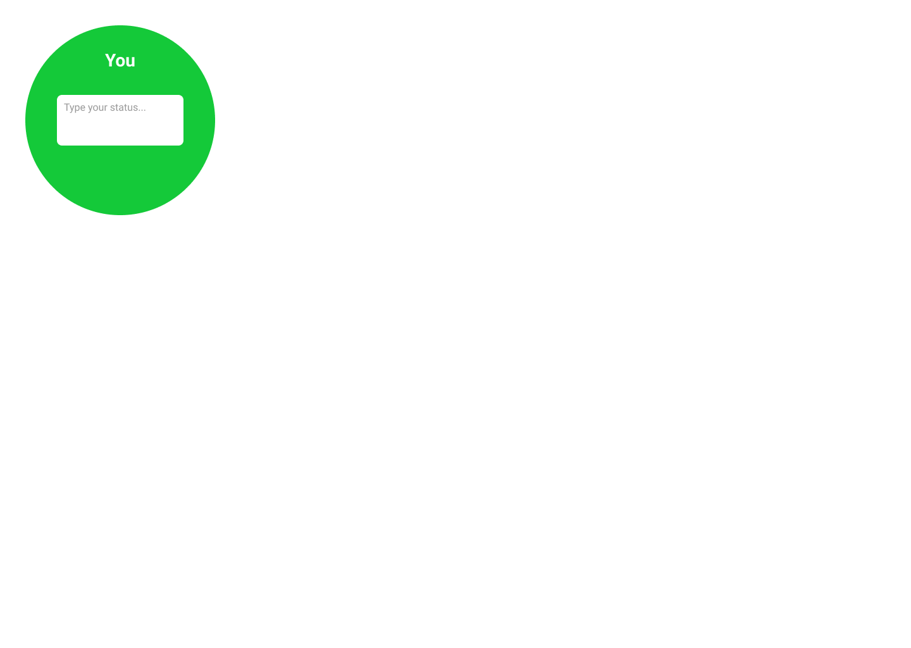
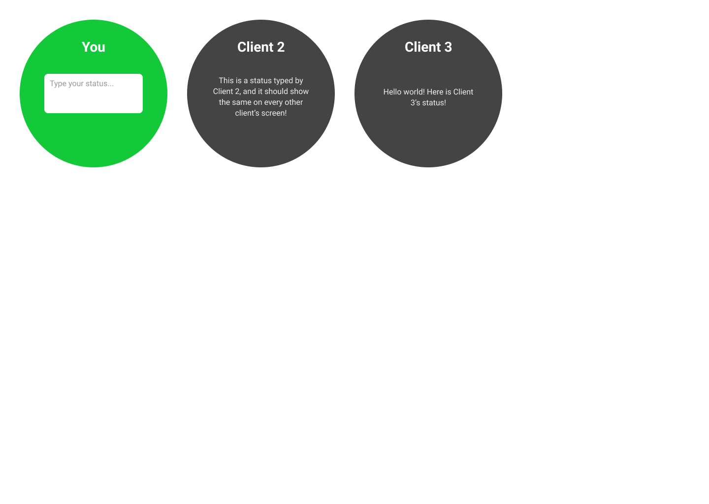
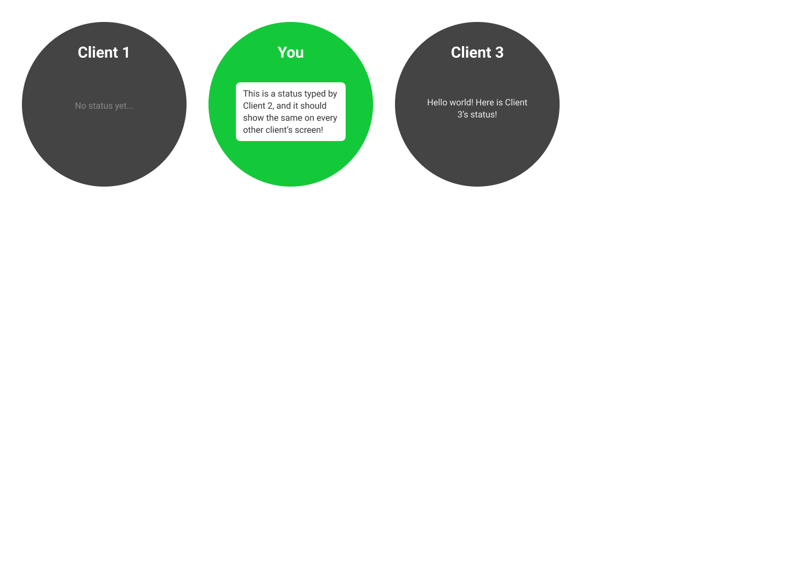

# Spot.xyz Fullstack Takehome

This challenge involves the implementation of a basic application _from scratch_ with a javascript-based tech stack of your choosing. The only implementation requirement is the aforementioned detail that it must be written in javascript and/or typescript.

## Overview

The goal of this challenge is to create a very basic application which shows "statuses" for each browser client ("tab") currently viewing it. Here are some [basic figma mocks](https://www.figma.com/file/94Hc0muDA8aPjmKvClZgiS/Full-Stack-Take-Home-Assignment?node-id=0%3A1).

For instance, when the application is first opened within a browser tab, the following should be displayed:

If two more browser tabs are opened with the URL of the application, the first tab should adjust to display the following:

Whereas the second tab opened should display the following:

If at any point, one of the tabs updates the status text and presses the enter key, it should be reflected on all the other tabs.

## Bonus Points

At a minimum we only ask that you complete the challenge above, but some ideas of things that might impress us:

- Use the same tech stack as spot.xyz (currently we are using typescript, nestjs, react, and apollo)
- Basic testing
- Incorporation of a backend storage technology
- Realtime update of status changes
- Maintain order of the statuses on page refresh
- Display more metadata (e.g. timestamp of last status update)
- Implement URL-based rooms which contain a unique list of clients.

## Submitting the Completed Challenge

Please see the readme in the parent directory.
